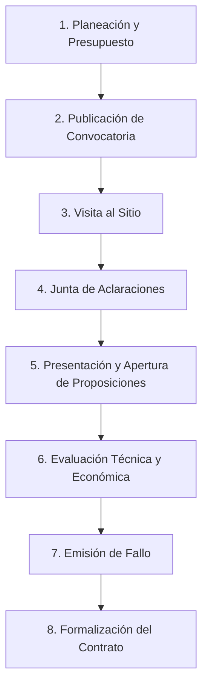

# Guía de Licitaciones Públicas en México
## Marco Legal, Proceso y Normatividad (2024–2025)

> [!IMPORTANT]
> **Reforma integral publicada el 16 de abril de 2025 en el DOF.** Se expidió una nueva LAASSP (abrogando la del año 2000) y se reformó la LOPSRM. Vigencia: 17 de abril de 2025. Los procedimientos en trámite a esa fecha continúan bajo la legislación anterior.

---

## 1. Marco Legal Vigente

### 1.1 Legislación Principal

| Ordenamiento | Ámbito | Última reforma relevante |
|---|---|---|
| **LOPSRM** — Ley de Obras Públicas y Servicios Relacionados con las Mismas | Obras públicas y servicios relacionados | DOF 16-abr-2025 (reforma) |
| **LAASSP** — Ley de Adquisiciones, Arrendamientos y Servicios del Sector Público | Adquisiciones, arrendamientos y servicios | DOF 16-abr-2025 (**nueva ley**) |
| **Reglamento de la LOPSRM** | Detalle operativo de la LOPSRM | Vigente con adecuaciones |
| **PEF 2025 — Anexo 9** | Montos máximos para AD e ITP | DOF dic-2024 |
| **Constitución Política (Art. 134)** | Principio de licitación pública como regla general | Vigente |

### 1.2 Cambios Clave de la Reforma 16 de Abril de 2025

1. **Plataforma Digital de Contrataciones Públicas** — Sustituye a CompraNet. Digitalización integral del ciclo de contratación con firma electrónica de contratos.
2. **Tienda Digital del Gobierno Federal** — Módulo para adquisición centralizada mediante acuerdos marco.
3. **Comité de Contrataciones Estratégicas** — Órgano colegiado (Secretaría Anticorrupción, SHCP, SE).
4. **Nuevos procedimientos:** Diálogo Competitivo, Ofertas Subsecuentes de Descuento, Adjudicación Directa con Estrategia de Negociación, Acuerdos Marco.
5. **Criterios de precio:** "Precio no aceptable" (>10% del promedio de mercado) y "Precio no conveniente" (<40% del promedio de mercado).
6. **Contenido nacional:** Incremento del 50% al 65%.
7. **Reducción de plazos** en diversas etapas del proceso licitatorio.

### 1.3 Normatividad Complementaria

- Ley Federal de Presupuesto y Responsabilidad Hacendaria
- Ley Federal Anticorrupción en Contrataciones Públicas
- Ley Federal de Competencia Económica
- Lineamientos de la Secretaría Anticorrupción y Buen Gobierno (antes SFP)
- Normas de construcción SCT/SICT y normas NOM aplicables

---

## 2. Tipos de Procedimientos de Contratación

### 2.1 Cuadro Comparativo

| Procedimiento | Fundamento LOPSRM | Cuándo aplica | Participantes |
|---|---|---|---|
| **Licitación Pública Nacional** | Arts. 27-I, 30 | Regla general. Monto supera límites de AD e ITP | Cualquier persona de nacionalidad mexicana |
| **Licitación Pública Internacional** | Arts. 27-I, 30 | No existe oferta nacional suficiente o por tratados internacionales | Incluye empresas extranjeras |
| **Invitación a Cuando Menos 3 Personas** | Arts. 27-II, 43 | Monto dentro de rangos del Anexo 9 PEF o excepciones Art. 42 | Mínimo 3 invitados |
| **Adjudicación Directa** | Arts. 27-III, 43 | Monto dentro de rangos Anexo 9 PEF o excepciones Art. 42 | Un solo contratista |

### 2.2 Montos Máximos PEF 2025 — Obra Pública (miles de pesos s/IVA)

| Presupuesto autorizado (miles $) | AD Obra Pública | ITP Obra Pública |
|---|---|---|
| Hasta $15,000 | $479 | $3,620 |
| $15,001 – $30,000 | $566 | $4,284 |
| $30,001 – $50,000 | $650 | $4,869 |
| $50,001 – $100,000 | $722 | $5,404 |
| $100,001 – $150,000 | $985 | $7,326 |
| $150,001 – $250,000 | $1,140 | $8,651 |
| $250,001 – $350,000 | $1,329 | $10,087 |
| Más de $2,700,000 | $3,732 | $27,716 |

> [!NOTE]
> Los montos se determinan según el presupuesto total autorizado a la dependencia para obras públicas en el ejercicio fiscal.

---

## 3. Proceso Cronológico de Licitación Pública Nacional

### Etapa 1 — Planeación y Presupuesto
- Programa Anual de Obras Públicas, investigación de mercado, presupuesto base.

### Etapa 2 — Publicación de Convocatoria
- **Medio:** Plataforma Digital de Contrataciones Públicas (antes CompraNet) y DOF.
- **Plazo mínimo:** 15 días naturales antes de la apertura de proposiciones (Art. 32).
- **Plazo reducido:** 10 días naturales en casos justificados (Art. 33).

### Etapa 3 — Visita al Sitio de los Trabajos
- Obligatoria. Se levanta acta circunstanciada.

### Etapa 4 — Junta de Aclaraciones
- Mínimo 6 días naturales antes de la presentación de proposiciones.
- Preguntas enviadas con 24 horas de anticipación mínima.
- Modificaciones a bases son obligatorias para todos los participantes.

### Etapa 5 — Presentación y Apertura de Proposiciones
- Modalidad: electrónica, presencial o mixta.
- Se reciben sobres (propuesta técnica y propuesta económica).
- Se da lectura al importe total de cada propuesta.

### Etapa 6 — Evaluación de Proposiciones (Art. 36 y 36 Bis)

| Criterio | Descripción | Uso |
|---|---|---|
| **Binario** | Cumple/No cumple. Se adjudica al precio más bajo solvente | Obras de baja complejidad técnica |
| **Puntos y Porcentajes** | Ponderación técnica (mín. 50%) + económica (máx. 50%) | Obras de mediana-alta complejidad |
| **Costo-Beneficio** | Costo total de propiedad o rendimiento a largo plazo | Infraestructura de larga vida útil |

### Etapa 7 — Emisión del Fallo
- Dentro de **40 días naturales** después de la apertura (puede diferirse 20 días más).
- Acta de fallo: razón de adjudicación, propuestas desechadas y motivos, ganador, monto y plazo.

### Etapa 8 — Formalización del Contrato
- Dentro de **15 días naturales** siguientes a la notificación del fallo (Art. 47).
- Se presentan garantías antes de la firma.

---

## 4. Documentos del Licitante

### 4.1 Documentación Legal-Administrativa

| # | Documento |
|---|---|
| 1 | Acta constitutiva y modificaciones (personas morales) |
| 2 | Poder notarial del representante legal |
| 3 | Identificación oficial vigente (INE/pasaporte) |
| 4 | RFC y Constancia de Situación Fiscal vigente |
| 5 | CURP del representante legal |
| 6 | Opinión positiva de cumplimiento fiscal (SAT — 32-D CFF) |
| 7 | Opinión positiva IMSS |
| 8 | Opinión positiva INFONAVIT |
| 9 | Declaración de no inhabilitación (bajo protesta de decir verdad) |
| 10 | Declaración de integridad (no prácticas monopólicas) |
| 11 | Registro en padrón de contratistas (según convocatoria) |
| 12 | e.firma vigente (para participación electrónica) |

### 4.2 Propuesta Técnica

| # | Documento |
|---|---|
| 1 | Metodología y procedimiento constructivo |
| 2 | Programa de ejecución (Gantt / ruta crítica) |
| 3 | Programa de suministro de materiales |
| 4 | Programa de maquinaria y equipo |
| 5 | CV del superintendente y personal clave |
| 6 | Relación de contratos similares (últimos 3–5 años) |
| 7 | Catálogo de conceptos (sin precios) |
| 8 | Programa de aseguramiento de calidad |

### 4.3 Propuesta Económica

| # | Documento |
|---|---|
| 1 | Catálogo de conceptos con precios unitarios |
| 2 | Análisis de precios unitarios (materiales, M.O., equipo, indirectos, utilidad) |
| 3 | Explosión de insumos |
| 4 | Tabulador de salarios |
| 5 | Análisis del factor de salario real |
| 6 | Programa de erogaciones (flujo mensual) |
| 7 | Análisis de indirectos, financiamiento y utilidad |
| 8 | Presupuesto total con IVA |

---

## 5. Garantías Requeridas

| Garantía | Porcentaje | Momento | Instrumento |
|---|---|---|---|
| **Seriedad** | 5% – 10% de la propuesta (s/IVA) | Con la propuesta económica | Cheque certificado o fianza |
| **Cumplimiento** | **10%** del contrato (s/IVA) | Antes de firma del contrato | Póliza de fianza |
| **Anticipo** | **100%** del anticipo otorgado (c/IVA) | Previo a entrega del anticipo | Póliza de fianza |
| **Vicios ocultos** | **10%** de la obra ejecutada | A la entrega-recepción | Fianza (vigencia mín. 12 meses) |

> [!NOTE]
> Los anticipos suelen oscilar entre el 10% y 30% del contrato. Las fianzas deben ser de afianzadoras autorizadas por la CNSF.

---

## 6. Causas de Descalificación Más Comunes

> [!WARNING]
> Solo el incumplimiento de requisitos **esenciales** de la convocatoria es causa de descalificación. No se permiten cláusulas discrecionales.

| # | Causa | Fundamento |
|---|---|---|
| 1 | No presentar documentos obligatorios de las bases | Art. 37 |
| 2 | Propuesta que exceda el presupuesto base | Art. 38 |
| 3 | Documentación con información falsa o alterada | Art. 37 y LFACP |
| 4 | No acreditar experiencia mínima en obras similares | Bases |
| 5 | Garantía de seriedad omitida o insuficiente | Bases |
| 6 | Propuestas condicionadas, incompletas o con tachaduras no salvadas | Art. 37 |
| 7 | Estar inhabilitado por la Secretaría Anticorrupción | Art. 51 |
| 8 | No estar al corriente en obligaciones fiscales (SAT, IMSS, INFONAVIT) | Art. 31-XXVI |
| 9 | No firmar acta de visita de obra (si es obligatorio) | Bases |
| 10 | Entrega extemporánea de proposiciones | Art. 37 |
| 11 | Prácticas monopólicas o colusión entre licitantes | LFCE |

---

## 7. Medios de Impugnación — Inconformidad

### Fundamento: Art. 83 y siguientes LOPSRM

**Actos impugnables:** Convocatoria, juntas de aclaraciones, presentación/apertura, fallo, cancelación injustificada.

| Acto impugnado | Plazo |
|---|---|
| Convocatoria y juntas de aclaraciones | **6 días hábiles** tras la última junta |
| Presentación/apertura y fallo | **10 días hábiles** tras notificación |

**Presentación:** Escrito ante la Secretaría Anticorrupción o electrónica vía Plataforma Digital.

**Requisitos:** Identificación del procedimiento, actos impugnados, hechos, agravios, pruebas documentales.

**Instancias posteriores:**
1. Recurso de Revisión (LFPA)
2. Juicio Contencioso Administrativo (TFJA)
3. Amparo

---

## Fuentes Consultadas

- DOF — Diario Oficial de la Federación (dof.gob.mx)
- Plataforma Digital de Contrataciones / CompraNet (compranet.hacienda.gob.mx)
- Secretaría Anticorrupción y Buen Gobierno (antes SFP)
- Cámara de Diputados — Leyes Federales
- PEF 2025 — Anexo 9
- Garrigues, Von Wobeser y Sierra, Tena Abogados, KPMG México — Análisis de reforma 16-abr-2025
- CMIC — Cámara Mexicana de la Industria de la Construcción
