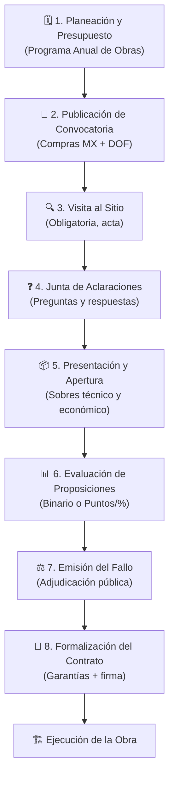

# 📅 Proceso Cronológico de Licitación Pública Nacional

> La rigurosidad procesal es **absoluta**. Cualquier desviación de los plazos o formalidades acarrea nulidad de los actos y responsabilidades administrativas.

---

## Diagrama General del Proceso

---

## Cuadro de Plazos Legales

| Etapa | Plazo | Fundamento | Nota |
|---|---|---|---|
| Convocatoria → Apertura | **Mín. 15 días naturales** (10 con reforma 2025 para LPN) | Art. 32 LOPSRM | Desde la publicación |
| Convocatoria → Apertura (reducido) | **10 días naturales** | Art. 33 LOPSRM | Solo con causa justificada |
| Visita al sitio → Junta de aclaraciones | No hay mínimo fijo; debe quedar tiempo | Convocatoria | Lógica procesal |
| Junta aclaraciones → Apertura | **Mín. 6 días naturales** | Art. 32 LOPSRM | Entre la última junta y la apertura |
| Preguntas para junta | **24 horas antes** de la junta | Reglamento | Mínimo; la convocatoria puede ampliar |
| Apertura → Fallo | **Máx. 40 días naturales** (20 con reforma 2025) | Art. 39 LOPSRM | Prorrogable una vez por 20 días más |
| Fallo → Firma del contrato | **Máx. 15 días naturales** | Art. 47 LOPSRM | Desde la notificación del fallo |

> [!NOTE]
> Con la **reforma de 2025**, el plazo apertura → fallo se redujo de 40 a **20 días naturales** en licitaciones nacionales. Esto exige mayor agilidad en la evaluación interna.

---

## Detalle de Cada Etapa

### 🗓️ Etapa 0 — Planeación
- Elaboración del **Programa Anual de Obras Públicas**
- Investigación de mercado o **Diálogos Estratégicos** (nuevo en 2025)
- Definición del presupuesto base
- Elaboración del catálogo de conceptos y especificaciones técnicas
- Publicación opcional del **proyecto de convocatoria** (5 días hábiles para comentarios públicos, reforma 2025)

### 📢 Etapa 1 — Publicación de Convocatoria
→ Ver nota completa: [[📢 Etapa 1 — Convocatoria]]
- Publicación simultánea en **Compras MX** y **DOF**
- Contenido mínimo establecido en Art. 31 LOPSRM
- Plazo mínimo: 15 días naturales (10 en casos justificados)

### 🔍 Etapa 2 — Visita al Sitio y Junta de Aclaraciones
→ Ver nota completa: [[🔍 Etapa 2 — Visita al Sitio y Junta de Aclaraciones]]
- Visita: **obligatoria**, se levanta acta; los licitantes deben firmarla si así lo requieren las bases
- Junta: **electrónica vía Compras MX**; las respuestas forman parte integral de la convocatoria

### 📦 Etapa 3 — Presentación y Apertura de Proposiciones
→ Ver nota completa: [[📦 Etapa 3 — Presentación y Apertura de Proposiciones]]
- Se reciben sobres técnico y económico (por separado)
- Apertura: primero técnico, luego económico solo de los técnicamente solventes
- Se levanta acta con nombres y montos de todos los licitantes

### 📊 Etapa 4 — Evaluación de Proposiciones
→ Ver nota completa: [[📊 Etapa 4 — Evaluación de Proposiciones]]
- Se realiza **a puerta cerrada** por el comité técnico
- Dos criterios: **Binario** o **Puntos y Porcentajes**

### ⚖️ Etapa 5 — Fallo y Contrato
→ Ver nota completa: [[⚖️ Etapa 5 — Fallo y Contrato]]
- Notificación pública del adjudicatario
- Firma del contrato y presentación de garantías

---

## Regla del "Segundo Lugar"

> Si el ganador no firma el contrato o no entrega las garantías en el plazo establecido, la dependencia puede adjudicar al **segundo lugar**, siempre que la diferencia de precio entre ambas propuestas **no exceda el 10%**.

---

## Ver También

- [[📢 Etapa 1 — Convocatoria]] — Contenido y plazos de publicación
- [[🔍 Etapa 2 — Visita al Sitio y Junta de Aclaraciones]] — Actas y preguntas vinculantes
- [[📦 Etapa 3 — Presentación y Apertura de Proposiciones]] — e.firma y sobres
- [[📊 Etapa 4 — Evaluación de Proposiciones]] — Binario vs. puntos y porcentajes
- [[⚖️ Etapa 5 — Fallo y Contrato]] — Adjudicación y garantías
- [[📅 Caso Morelia — Calendario de Eventos]] — Ejemplo con fechas concretas verificadas
