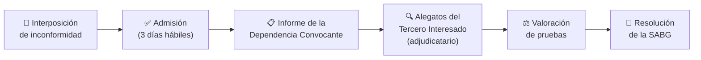

# 📝 Recurso de Inconformidad

> El recurso de inconformidad es el **remedio jurídico expedito** para cuando la dependencia vulneró el marco legal o las bases de la licitación. Es un procedimiento **cuasi-jurisdiccional administrativo**, sustanciado por la SABG (antes SFP), no por tribunales.

---

## Fundamento Legal

| Ley | Artículo | Contenido |
|---|---|---|
| LOPSRM | **Art. 83 y siguientes** | Inconformidad en obra pública |
| LAASSP | **Art. 65 y siguientes** | Inconformidad en adquisiciones |

---

## ¿Contra Qué Se Puede Inconformar?

| Acto impugnable | Cuándo |
|---|---|
| La convocatoria o las bases | Después de la última junta de aclaraciones |
| Las juntas de aclaraciones | Igual que convocatoria |
| Acto de presentación y apertura | Dentro de los plazos tras el acto |
| Desechamientos en apertura | Desde que se notifica |
| El fallo adjudicatorio | Desde la notificación del fallo |
| Cancelación injustificada del procedimiento | Desde que se notifica |
| Omisiones que impidan la formalización del contrato | Desde que se conocen |

> [!WARNING]
> Los actos **consentidos expresa o tácitamente** no son impugnables. Si no te inconformaste de la convocatoria en el plazo, ya no puedes alegar sus deficiencias en contra del fallo.

---

## Plazos — El Factor Más Crítico

| Acto impugnado | Plazo | Tipo de días |
|---|---|---|
| Convocatoria y juntas de aclaraciones | **6 días** desde la última junta | **Hábiles** |
| Presentación, apertura y desechamientos | **6 días** desde el acto | **Hábiles** |
| **Fallo** | **6 días** desde la notificación | **Hábiles** |

> [!CAUTION]
> **Los plazos son fatales.** Un solo día de retraso extingue el derecho. Los días inhábiles (sábados, domingos y festivos del calendario SABG publicado en el DOF) no se cuentan. Tener asesoría legal desde el inicio del procedimiento es indispensable.

*Nota: La reforma 2025 uniformizó en **6 días hábiles** para todos los actos (antes algunos eran 10 días). Verificar en el texto vigente de la LOPSRM.*

---

## Cómo Presentar la Inconformidad

**Formas de presentación:**
1. **Electrónica** vía Plataforma Digital Compras MX (preferida)
2. **Escrito** en la Oficialía de Partes de la SABG

**Requisitos del escrito inicial:**
1. Nombre completo y domicilio del inconforme (empresa y representante legal)
2. Número y descripción del procedimiento de contratación impugnado
3. Acto(s) específico(s) que se impugnan y fecha de conocimiento
4. Hechos y antecedentes del caso (narración cronológica)
5. **Agravios** — Los motivos jurídicos concretos de la inconformidad (el corazón del recurso)
6. Pruebas documentales relacionadas directamente con el acto impugnado
7. Solicitud de medida cautelar de suspensión (en su caso)

---

## El Proceso de Instrucción

---

## La Medida Cautelar de Suspensión

Es la herramienta más poderosa del inconforme. Puede solicitar:
- **Suspensión de la firma del contrato** — Si el fallo ya se emitió pero aún no se firma
- **Suspensión de la ejecución de los trabajos** — Si el contrato ya se firmó

**Requisito:** El inconforme debe presentar una **fianza suficiente** para responder por los daños y perjuicios que la suspensión cause al adjudicatario y a la dependencia.

---

## Sentidos de la Resolución

La SABG puede resolver en tres sentidos:

| Resolución | Descripción | Efecto |
|---|---|---|
| **Confirmar** | El fallo original fue legal | El contrato sigue con el adjudicatario |
| **Revocar** | El fallo tuvo vicios; se ordena nueva evaluación | La dependencia dicta nuevo fallo |
| **Anular** | El procedimiento completo fue ilegal | Se repone desde el momento viciado (puede ser desde la convocatoria) |

---

## Instancias Posteriores

Si la resolución de la SABG te es adversa:
→ Ver nota: [[🏛️ Instancias Posteriores — TFJA y Amparo]]

1. **Recurso de Revisión** — Ante la propia SABG (LFPA)
2. **Juicio Contencioso Administrativo** — Ante el Tribunal Federal de Justicia Administrativa (TFJA)
3. **Amparo Indirecto** — Ante el Juzgado de Distrito competente

---

## Ver También

- [[❌ Causas de Descalificación]] — Las causales que pueden sustentar tu inconformidad
- [[📊 Etapa 4 — Evaluación de Proposiciones]] — Errores en la evaluación que puedes impugnar
- [[⚖️ Etapa 5 — Fallo y Contrato]] — El fallo como el acto más frecuentemente impugnado
- [[📜 Caso Morelia — Acta de Fallo]] — El acta informa sobre el plazo de inconformidad
- [[🚨 Régimen Sancionatorio 2025]] — Sanciones a la dependencia si la inconformidad prospera
